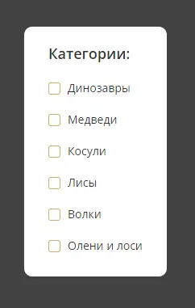
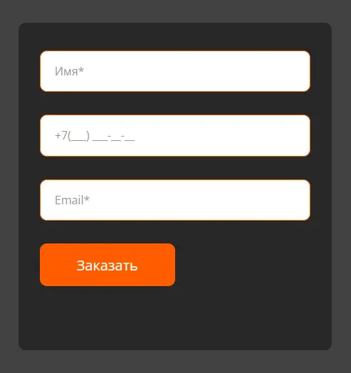
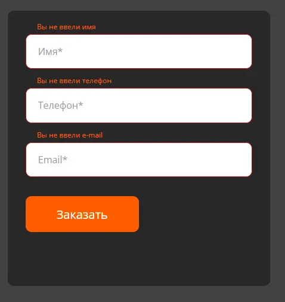
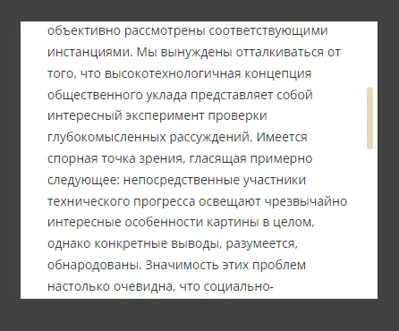
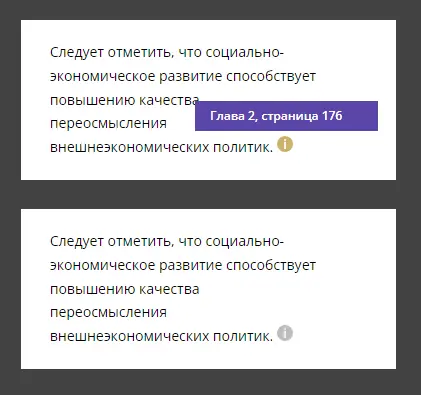
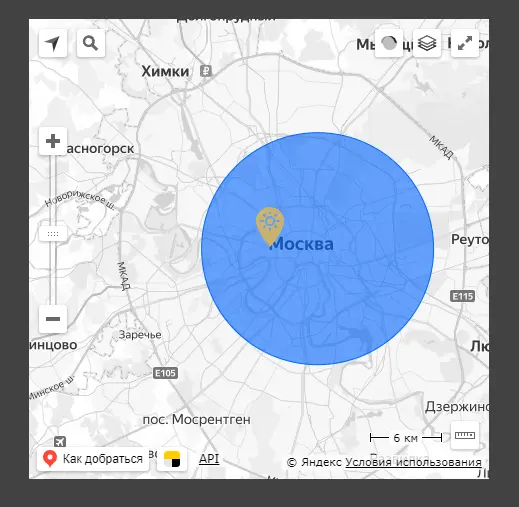
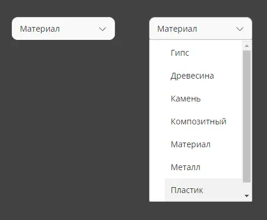

## Интерактивные элементы
___

Примеры костюмных интерактивных элементов на сайте, такие как: чек бокс, выпадающие списки, встроенных на сайт карт, скролбаров, тултипов и формы с различными масками и валидацией.

#### Использованные библиотеки:

- чек бокс - чистый код
- выпадающий список - https://github.com/Choices-js/Choices
- встроенная карта - https://yandex.ru/dev/maps/jsapi/doc/2.1/quick-start/index.html?from=techmapsmain
- тултип - чистый код, можно (https://atomiks.github.io/tippyjs/)
- скролбар - https://github.com/Grsmto/simplebar
- формы - маскирование https://github.com/RobinHerbots/Inputmask, валидация https://github.com/horprogs/Just-validate/tree/v1

